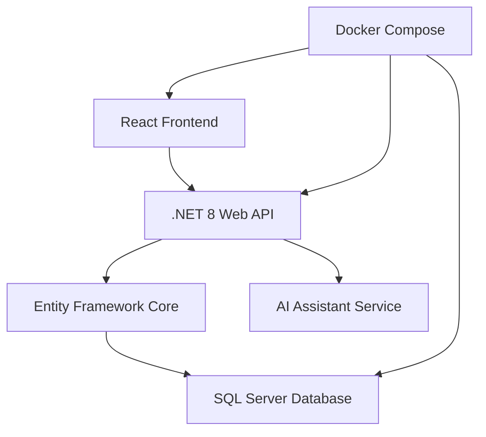

#

## 🌟 **Project Overview**

AIPharm+ is a cutting-edge digital pharmacy platform that combines traditional pharmaceutical care with modern AI technology. Built with .NET 8 backend and React frontend, it offers a seamless shopping experience with intelligent product recommendations and medical consultations.

### 🎯 **Key Highlights**
- 🤖 **AI Medical Assistant** - Get instant advice on medications
- 🛒 **Smart Shopping Cart** - Real-time inventory and pricing
- 🔍 **Advanced Search** - Find products by name, ingredient, or category
- 📱 **Mobile-First Design** - Responsive across all devices
- 🌍 **Multi-Language Support** - Bulgarian and English
- 🐳 **Docker Ready** - One-command deployment

---

## 🚀 **Quick Start**

### **Prerequisites**
- [Docker Desktop](https://www.docker.com/products/docker-desktop/) installed
- Git for cloning the repository

### **Installation**
```bash
# Clone the repository
git clone https://github.com/yourusername/aipharm-plus.git
cd aipharm-plus

# Start everything with  🏥 AIPharm+ - Modern AI-Powered Digital Pharmacy

<div align="center">


**A full-featured e-commerce platform for pharmacies with AI assistant, modern design, and automated database management.**

[](https://dotnet.microsoft.com/)
[](https://reactjs.org/)
[](https://www.typescriptlang.org/)
[](https://www.docker.com/)
[](LICENSE)

[🚀 Quick Start](#-quick-start) • [✨ Features](#-features) • [🏗️ Architecture](#️-architecture) • [📖 Documentation](#-documentation) • [🤝 Contributing](#-contributing)

</div>

---Docker
docker-compose up
```

### **Access the Application**
- 🌐 **Frontend**: http://localhost:3000
- 🔧 **Backend API**: http://localhost:8080
- 📚 **Swagger Documentation**: http://localhost:8080/swagger
- 🗄️ **Database**: localhost:1433 (sa/YOURPASSWORD)

### **Default Account**
| Role | Email | Password |
|------|-------|----------|
| 👑 **Admin (default)** | aipharmplus@outlook.com | Admin123! |
| 🛍️ **Customer** | maria.ivanova@example.com | Customer123! |
| 🛍️ **Customer** | georgi.petrov@example.com | Customer456! |
| 🛍️ **Customer** | iva.stoyanova@example.com | Customer789! |

> **Note:** Registration confirmations and two-factor verification emails are sent from `aipharmplus@outlook.com`. If you enable the optional pickup folder (`Email:UsePickupDirectory = true`) the messages are written to `AIPharm.Backend/AIPharm.Web/App_Data/Emails`; otherwise they are delivered straight to each recipient's inbox.

---

## ✨ **Features**

<table>
<tr>
<td width="50%">

### 🎨 **Frontend Features**
- ✅ Modern React 18 with TypeScript
- ✅ Tailwind CSS for styling
- ✅ Framer Motion animations
- ✅ Responsive design (mobile-first)
- ✅ Real-time cart updates
- ✅ Multi-language support (BG/EN)
- ✅ AI chat integration
- ✅ Advanced product filtering
- ✅ User authentication & profiles

</td>
<td width="50%">

### ⚙️ **Backend Features**
- ✅ .NET 8 Web API
- ✅ Clean Architecture pattern
- ✅ Entity Framework Core
- ✅ JWT Authentication
- ✅ AutoMapper integration
- ✅ Swagger/OpenAPI docs
- ✅ SQL Server database
- ✅ Repository pattern
- ✅ Dependency injection
- ✅ Health checks

</td>
</tr>
</table>

### 🤖 **AI Assistant Capabilities**
- 💊 **Medication Information** - Detailed drug information and usage
- ⚠️ **Side Effects** - Comprehensive safety information
- 💡 **Dosage Guidance** - Proper usage instructions
- 🔄 **Drug Interactions** - Safety warnings and recommendations
- 📋 **General Health Advice** - Basic medical guidance

---

## 🏗️ **Architecture**

### **System Architecture**


### **Project Structure**
```
AIPharm/
├── 🌐 Frontend (React + TypeScript)
│   ├── src/
│   │   ├── components/          # UI Components
│   │   ├── context/             # State Management
│   │   ├── services/            # API Integration
│   │   └── types/               # TypeScript Definitions
│   └── public/                  # Static Assets
│
├── 🔧 Backend (.NET 8)
│   ├── AIPharm.Web/             # API Controllers
│   ├── AIPharm.Core/            # Business Logic
│   ├── AIPharm.Domain/          # Entities & Models
│   └── AIPharm.Infrastructure/  # Data Access Layer
│
└── 🐳 Docker Configuration
    ├── docker-compose.yml       # Service Orchestration
    ├── Dockerfile.frontend      # React Container
    └── Dockerfile.backend       # .NET Container
```

### **Technology Stack**

<div align="center">

| Layer | Technologies |
|-------|-------------|
| **Frontend** |     |
| **Backend** |    |
| **Database** |  |
| **DevOps** |   |

</div>

---

## 📊 **Database Schema**

### **Core Entities**
```sql
Users (Authentication & Profiles)
├── Categories (Product Organization)
│   └── Products (Pharmacy Inventory)
│       ├── CartItems (Shopping Cart)
│       └── OrderItems (Purchase History)
└── Orders (Transaction Records)
```

### **Sample Data**
- 📦 **12+ Products** with real pharmaceutical data
- 🏷️ **6 Categories** (Painkillers, Vitamins, Cold & Flu, etc.)
- 👤 **Default Admin Account** with email 2FA enabled
- 🛒 **Shopping Cart** functionality
- 📋 **Order Management** system

---

## 🛠️ **Development**

### **Local Development Setup**

#### **Option 1: Docker (Recommended)**
```bash
# Clone and start
git clone https://github.com/yourusername/aipharm-plus.git
cd aipharm-plus
docker-compose up
```

#### **Option 2: Manual Setup**
```bash
# Backend (.NET 8 required)
cd AIPharm.Backend
dotnet restore
dotnet run --project AIPharm.Web

# Frontend (Node.js 18+ required)
npm install
npm run dev
```

### **Available Scripts**
```bash
# Docker commands
docker-compose up          # Start all services
docker-compose down        # Stop all services
docker-compose build       # Rebuild containers
docker-compose logs        # View logs

# Development commands
npm run dev               # Start frontend dev server
npm run build            # Build for production
dotnet run               # Start backend API
dotnet test              # Run backend tests
```

### **Environment Configuration**
```bash
# Copy environment template
cp .env.example .env

# Configure your settings
VITE_API_BASE_URL=http://localhost:8080/api
SA_PASSWORD=YourStrongPassword123!
JWT_KEY=YourSuperSecretJWTKey
```

---

## 📖 **API Documentation**

### **Core Endpoints**

#### **🔐 Authentication**
```http
POST /api/auth/login      # User login
POST /api/auth/register   # User registration
GET  /api/auth/me         # Current user info
POST /api/auth/logout     # User logout
```

#### **🛍️ Products**
```http
GET    /api/products           # Get products (with filtering)
GET    /api/products/{id}      # Get product details
GET    /api/products/search    # Search products
POST   /api/products           # Create product (Admin)
PUT    /api/products/{id}      # Update product (Admin)
DELETE /api/products/{id}      # Delete product (Admin)
```

#### **🛒 Shopping Cart**
```http
GET    /api/cart              # Get current cart
POST   /api/cart/items        # Add item to cart
PUT    /api/cart/items/{id}   # Update cart item
DELETE /api/cart/items/{id}   # Remove from cart
DELETE /api/cart              # Clear cart
```

#### **🤖 AI Assistant**
```http
POST /api/assistant/ask       # Ask AI a question
GET  /api/assistant/history   # Get conversation history
```

### **Response Examples**

<details>
<summary>📦 Product Response</summary>

```json
{
  "id": 1,
  "name": "Парацетамол 500мг",
  "nameEn": "Paracetamol 500mg",
  "description": "Ефективно обезболяващо и жаропонижаващо средство",
  "price": 2.30,
  "stockQuantity": 150,
  "categoryId": 1,
  "categoryName": "Обезболяващи",
  "requiresPrescription": false,
  "activeIngredient": "Парацетамол",
  "dosage": "500мг",
  "manufacturer": "Актавис",
  "rating": 4.7,
  "reviewCount": 89
}
```
</details>

<details>
<summary>🛒 Cart Response</summary>

```json
{
  "id": 1,
  "userId": "demo-user",
  "items": [
    {
      "id": 1,
      "productId": 1,
      "productName": "Парацетамол 500мг",
      "quantity": 2,
      "unitPrice": 2.30,
      "totalPrice": 4.60
    }
  ],
  "total": 4.60,
  "itemCount": 2
}
```
</details>

---

## 🧪 **Testing**

### **Backend Testing**
```bash
# Run all tests
dotnet test

# Run with coverage
dotnet test --collect:"XPlat Code Coverage"
```

### **Frontend Testing**
```bash
# Unit tests
npm run test

# E2E tests
npm run test:e2e

# Coverage report
npm run test:coverage
```

### **API Testing**
- 📚 **Swagger UI**: http://localhost:8080/swagger
- 🔧 **Postman Collection**: Available in `/docs` folder
- 🤖 **Automated Tests**: Included in CI/CD pipeline

---

## 🚀 **Deployment**

### **Docker Deployment (Recommended)**
```bash
# Production build
docker-compose -f docker-compose.prod.yml up -d

# Scale services
docker-compose up --scale frontend=2 --scale backend=3
```

### **Cloud Deployment**
- ☁️ **Azure**: App Service + SQL Database
- 🌐 **AWS**: ECS + RDS
- 🔥 **Google Cloud**: Cloud Run + Cloud SQL
- 🌊 **DigitalOcean**: App Platform + Managed Database

### **Environment Variables**
```bash
# Production settings
ASPNETCORE_ENVIRONMENT=Production
ConnectionStrings__DefaultConnection=YourProductionConnectionString
Jwt__Key=YourProductionJWTKey
VITE_API_BASE_URL=https://your-api-domain.com/api
```

---

## 📈 **Performance & Monitoring**

### **Performance Features**
- ⚡ **Vite** for fast frontend builds
- 🔄 **Hot Module Replacement** in development
- 📦 **Code Splitting** for optimized loading
- 🗄️ **Entity Framework** query optimization
- 💾 **Response Caching** for API endpoints
- 🔍 **Database Indexing** for fast searches

### **Monitoring**
- 🏥 **Health Checks** - `/api/health`
- 📊 **Application Insights** integration ready
- 📝 **Structured Logging** with Serilog
- 🔍 **Error Tracking** and reporting

---

## 🔒 **Security**

### **Authentication & Authorization**
- 🔐 **JWT Tokens** with secure signing
- 👤 **Role-based Access Control** (Admin/User)
- 🛡️ **Password Hashing** with BCrypt
- 🔄 **Token Refresh** mechanism
- 🚫 **Rate Limiting** for API protection

### **Data Protection**
- 🔒 **HTTPS** enforcement
- 🛡️ **CORS** configuration
- 🔐 **SQL Injection** protection via EF Core
- 🧹 **Input Validation** and sanitization
- 📝 **Audit Logging** for sensitive operations

---

## 🌍 **Internationalization**

### **Supported Languages**
- 🇧🇬 **Bulgarian** (Default)
- 🇬🇧 **English**

### **Features**
- 🔄 **Dynamic Language Switching**
- 🏷️ **Product Name Translation**
- 📱 **UI Component Translation**
- 🌐 **API Response Localization**
- 🎌 **Country Flag Indicators**

---

## 🤝 **Contributing**

We welcome contributions! Here's how you can help:

### **Getting Started**
1. 🍴 **Fork** the repository
2. 🌿 **Create** a feature branch: `git checkout -b feature/amazing-feature`
3. 💻 **Make** your changes
4. ✅ **Test** your changes
5. 📝 **Commit**: `git commit -m 'Add amazing feature'`
6. 🚀 **Push**: `git push origin feature/amazing-feature`
7. 🔄 **Create** a Pull Request

### **Development Guidelines**
- 📋 Follow existing code style
- ✅ Add tests for new features
- 📝 Update documentation
- 🔍 Ensure all tests pass
- 📱 Test on multiple devices

### **Code Style**
- **Backend**: Follow C# conventions and Clean Code principles
- **Frontend**: Use ESLint and Prettier configurations
- **Database**: Use descriptive names and proper indexing
- **Docker**: Optimize container sizes and security

---

## 📄 **License**

This project is licensed under the **MIT License** - see the [LICENSE](LICENSE) file for details.

```
MIT License

Copyright (c) 2024 AIPharm+

Permission is hereby granted, free of charge, to any person obtaining a copy
of this software and associated documentation files (the "Software"), to deal
in the Software without restriction, including without limitation the rights
to use, copy, modify, merge, publish, distribute, sublicense, and/or sell
copies of the Software, and to permit persons to whom the Software is
furnished to do so, subject to the following conditions:

The above copyright notice and this permission notice shall be included in all
copies or substantial portions of the Software.
```

---

## 🙏 **Acknowledgments**

### **Technologies & Libraries**
- 🚀 [.NET 8](https://dotnet.microsoft.com/) - Backend framework
- ⚛️ [React](https://reactjs.org/) - Frontend library
- 🎨 [Tailwind CSS](https://tailwindcss.com/) - Styling framework
- 🐳 [Docker](https://www.docker.com/) - Containerization
- 🗄️ [Entity Framework Core](https://docs.microsoft.com/en-us/ef/core/) - ORM
- 🔧 [Vite](https://vitejs.dev/) - Build tool

### **Inspiration**
- 💊 Modern pharmacy management systems
- 🤖 AI-powered healthcare solutions
- 🛒 E-commerce best practices
- 📱 Mobile-first design principles

---

## 📞 **Support**

### **Getting Help**
- 📖 **Documentation**: Check our [Wiki](https://github.com/yourusername/aipharm-plus/wiki)
- 🐛 **Issues**: [Report bugs](https://github.com/yourusername/aipharm-plus/issues)
- 💬 **Discussions**: [Join conversations](https://github.com/yourusername/aipharm-plus/discussions)
- 📧 **Email**: aipharmplus@outlook.com (two-factor sender & admin inbox)

### **FAQ**
<details>
<summary>❓ How do I reset the database?</summary>

```bash
docker-compose down -v
docker-compose up
```
</details>

<details>
<summary>❓ How do I add new products?</summary>

1. Login as admin (aipharmplus@outlook.com / Admin123!)
2. Use the Swagger UI at http://localhost:8080/swagger
3. Use the POST /api/products endpoint
</details>

<details>
<summary>❓ How do I change the language?</summary>

Click the language switcher in the top-right corner (БГ/EN flags).
</details>

---

<div align="center">

### 🌟 **Star this repository if you found it helpful!**

[](https://github.com/yourusername/aipharm-plus/stargazers)
[](https://github.com/yourusername/aipharm-plus/network/members)
[](https://github.com/yourusername/aipharm-plus/issues)

**Made with ❤️ by the AIPharm+ Team**

[🔝 Back to Top](#-aipharm---modern-ai-powered-digital-pharmacy)

</div>